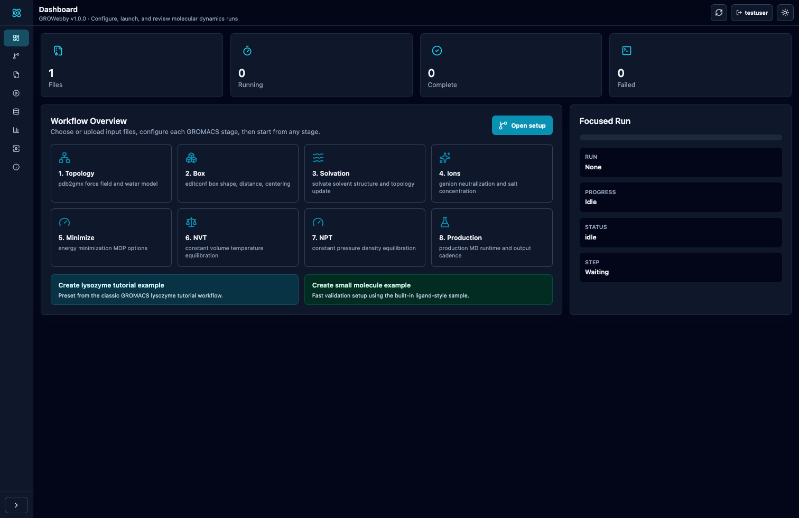

[](https://www.python.org/)
[](https://www.djangoproject.com/)
[](https://www.gromacs.org/)
[](https://gmxapi.org/)
[](https://react.dev/)
[](https://vitejs.dev/)
[](https://www.typescriptlang.org/)
[](https://nodejs.org/)
[](https://molstar.org/)
[](https://developer.nvidia.com/cuda-toolkit)
[-000000?logo=apple&logoColor=white)](https://developer.apple.com/metal/)
[](https://ubuntu.com/)
[](https://tailwindcss.com/)
[](https://www.docker.com/)
[](LICENSE)

---

# GROWebby

> **A Docker-based web interface for running GROMACS molecular dynamics simulations locally.**

GROWebby is a local web interface for GROMACS. You can upload coordinate files, configure simulation parameters, run jobs, and view the results directly in your browser. Each user gets their own isolated workspace, and an admin panel controls access.



---

## What is GROWebby?

Setting up a full MD pipeline in GROMACS usually requires a lot of command-line work, editing MDP files manually, and keeping track of intermediate outputs. GROWebby simplifies this by giving you a structured interface:

- **Upload** your `.pdb`, `.gro`, `.cif`, or `.mol2` structure files.
- **Configure** the pipeline steps (force fields, box setup, solvation, ions, minimization, NVT, NPT, and production).
- **Run** the simulation step-by-step or as a complete pipeline.
- **Monitor** energy, temperature, and pressure live as the simulation runs. The GROMACS command logs stream directly to the browser.
- **View** the results using the built-in 3D MolStar viewer and download your trajectories and logs.

Everything runs locally on your machine using Docker.

---

## Features at a Glance

| Feature | Details |
|---------|---------|
| Multi-stage MD pipeline | Topology -> Box -> Solvation -> Ions -> Minimize -> NVT -> NPT -> Production |
| 3D structure viewer | Embedded MolStar viewer, dark/light mode aware |
| Live simulation metrics | Real-time energy, temperature, and pressure charts |
| Multi-user workspaces | Each user has isolated files, runs, and results |
| Admin approval workflow | New registrations are inactive until an admin approves them |
| Dark / light mode | Persisted preference with full dark-mode UI compatibility |
| URL routing | Every page has its own URL and can be refreshed directly |
| Responsive layout | Collapsing sidebar and mobile navigation |
| Simulation history | Browse, inspect, and re-open previous runs |
| Run cancellation | Active GROMACS child process PID is stored and can be terminated from the Results page |

---

## Storage and Database

GROWebby currently uses Django's default SQLite database at `backend/db.sqlite3`. The database stores users, groups, uploaded-file records, simulation jobs, run status, current step, progress, metrics, clean event logs, artifact metadata, run grouping, workspace names, and the active GROMACS process PID while a command is running.

Large files are stored on disk under `.app_state/media/`, not inside the database. This includes uploaded structures, generated MDP files, GROMACS outputs, trajectories, energy files, and full command logs.

For Docker-based runs, the physical host storage path is:

```text
<project-root>/.app_state/media/workspaces/<run-workspace-slug>/
```

The same host directory is mounted in the backend container as `/app/media/workspaces` and in GROMACS engine containers as `/work/workspaces`.

---

## Quick Start

### Host Prerequisites

Before running the installation or startup scripts, make sure the required host dependencies are installed and configured:

* **All Profiles:**
  * **Docker** (version 27.x or higher) and **Docker Compose** v2 must be installed and running on your host system.
* **Linux (with NVIDIA GPU acceleration):**
  * You **must** have NVIDIA graphics drivers installed on the host.
  * You **must** install and configure the **NVIDIA Container Toolkit** on the host machine to allow Docker to bridge host GPU drivers to the container. See the [Linux NVIDIA GPU](#2-linux-nvidia-gpu-via-cuda) section below for the quick setup commands.
* **macOS (with Apple Silicon GPU acceleration):**
  * You **must** have a native macOS GROMACS build installed (e.g. `brew install gromacs`) that supports OpenCL.
  * You **must** have Python 3.14 (or similar native Python) installed on macOS to run the Django backend server natively outside Docker.

### Running the Application

#### Linux / macOS

```bash
git clone -b dev https://github.com/ramsainanduri/GROWebby.git
cd GROWebby
./install.sh   # auto-detects host engine profile and writes .env
./start.sh     # starts services based on the detected profile
```

### Windows

```bat
git clone -b dev https://github.com/ramsainanduri/GROWebby.git
cd GROWebby
start.bat
```

Once running, open your browser:

| Service | URL |
|---------|-----|
| **Frontend** | http://localhost:5173 |
| **Backend API** | http://localhost:8000/api/ |

The setup scripts automatically create a default admin account on first launch:

- **Username:** `admin`
- **Email:** `admin@growebby.local`
- **Password:** `admin`

Please sign in and change the admin password immediately in any shared or production environment.

---

## Documentation

Full documentation is available in [`docs/`](docs/README.md):

- [User Guide](docs/user-guide.md)
- [Simulation Workflow Reference](docs/simulation-workflow.md)
- [Administration and Access Control](docs/administration.md)
- [Architecture](docs/architecture.md)
- [Operations and Diagnostics](docs/operations.md)
- [Contributing](CONTRIBUTING.md)

### Building Documentation Locally

This project uses MkDocs to build its documentation.

```bash
# Install mkdocs and the material theme
pip install mkdocs-material

# Serve documentation locally at http://127.0.0.1:8000
mkdocs serve
```

### Pre-commit Hooks

Before contributing, install the pre-commit hooks to ensure formatting and linting:

```bash
pip install pre-commit
pre-commit install
```

---

## User Registration & Approval

GROWebby uses a moderated sign-up flow to prevent unauthorized access:

1. A new user fills in their **username**, **email**, **password**, and a **purpose** (why they need access).
2. The account is created as **inactive** — the user cannot sign in yet.
3. The admin opens the **Admin Panel** (`/admin`) and sees the pending request with the stated purpose.
4. The admin clicks **Approve** or **Deny**.
5. The approved user can now sign in normally.

---

## Architecture

```
growebby/
├── frontend/               # Vite + React 19 + TypeScript + Tailwind CSS
│   ├── src/
│   │   ├── App.tsx         # Application shell, routing, all page views
│   │   ├── lib/api.ts      # Typed API client (fetch + CSRF)
│   │   └── components/
│   │       ├── Viewer3D.tsx      # MolStar 3D viewer wrapper
│   │       └── ThemeToggle.tsx   # Dark / light mode toggle
│   └── public/
│       └── version.json    # App & tool version data (shown on About page)
│
├── backend/                # Django 6 REST API
│   ├── accounts/           # Auth, user profiles, admin approval endpoints
│   │   ├── models.py       # UserProfile (OneToOne → User, purpose field)
│   │   ├── views.py        # Login, register, session, admin CRUD
│   │   └── urls.py         # /auth/* routes
│   └── simulations/        # Job queue, file uploads, log streaming
│
├── docker/
│   ├── gromacs/            # GROMACS + CUDA image (requires NVIDIA GPU)
│   └── gromacs-cpu/        # GROMACS CPU-only image
│
└── docker-compose.yml      # Orchestrates frontend, backend, and engine
```

---

## Development

```bash
# Create local environment configuration once
cp .env.example .env

# Start the application
docker compose up

# Apply Django database migrations
docker exec growebby-backend-1 python manage.py migrate

# Create a superuser manually
docker exec -it growebby-backend-1 python manage.py createsuperuser

# Run backend tests
docker exec growebby-backend-1 python manage.py test

# Run frontend type-check + build
docker exec growebby-frontend-1 npm run build
```

## Environment Configuration

GROWebby reads runtime configuration from `.env`. The repository includes `.env.example` with safe defaults for normal local runs.

Important settings:

- `DJANGO_DEBUG=0` is the normal setting. Use `DJANGO_DEBUG=1` only while developing the backend.
- `GROWEBBY_SERVE_MEDIA=1` lets the local backend serve uploaded files and run artifacts even when debug mode is off.
- `GROWEBBY_ENGINE=docker-backend-cpu` runs GROMACS 2026.2 inside Docker with CPU/OpenMP support.
- `GROMACS_EXECUTION_MODE=backend-gmx-2026.2` is shown in health checks and run metadata.
- `GROMACS_BINARY=/usr/local/gromacs/bin/gmx` is the backend container path.
- `GROWEBBY_ALLOW_VALIDATION_RUNS=0` keeps runs on the real GROMACS path. Set it to `1` only for interface validation without a GROMACS executable.

`docker-compose.yml` uses these values through environment interpolation, so debug mode is controlled by `.env`, not hardcoded in Compose.

## Logs and Live Plots

The Results page shows clean run events in the log window. Full GROMACS command output is saved as per-run files under `logs/` and listed in Run Files. When a command fails, the UI shows a readable failure summary and the final error tail, while the complete verbose output remains available as a downloadable log artifact.

Live plots update while `mdrun` is active. GROWebby first publishes lightweight live progress points, then replaces them with extracted GROMACS energy data from `.edr`/`.xvg` files as soon as GROMACS flushes readable energy frames.

---

## GPU Acceleration

GROWebby supports GROMACS execution on CPU and GPU. Because GROMACS containerisation separates the compute engine from the web backend, different execution profiles require specific host configurations.

| Profile | Command / Activation | Host Requirements | How it works |
|---------|-----------------------|-------------------|--------------|
| **CPU Only** (`docker-backend-cpu`) | `./start.sh` | • Docker and Docker Compose | Runs GROMACS entirely on the CPU inside the backend container. Works on any x86_64 or arm64 machine. |
| **Apple Silicon GPU** (`mac-opencl-native`) | Run `./install.sh && ./start.sh` (automatic if native OpenCL is detected) | • macOS M-series hardware<br>• Python 3.14 on macOS host<br>• GROMACS built with OpenCL installed on host | Frontend runs in Docker. The Django backend runs natively on macOS and executes host GROMACS to access the Apple GPU via OpenCL. |
| **Linux NVIDIA GPU** (`cuda`) | Run `docker compose --profile cuda up` (and set `COMPOSE_PROFILES=cuda` in `.env`) | • Linux OS<br>• Host NVIDIA Driver >= 525.60.13<br>• Host [NVIDIA Container Toolkit](https://docs.nvidia.com/datacenter/cloud-native/container-toolkit/) | GROMACS executes inside a specialized CUDA container (`gromacs-cuda-engine`) utilizing the host's physical GPU. |

### Host Prerequisites for GPU Profiles

#### 1. macOS (Apple Silicon GPU via OpenCL)
Docker Desktop on macOS cannot pass through the Apple GPU to a Linux guest container. Therefore, running GROMACS on the macOS GPU requires running GROMACS and the backend natively on the host:
1. Install GROMACS on your Mac (e.g. `brew install gromacs`).
2. Run `gmx --version` and verify it displays:
   ```text
   GPU support: OpenCL
   ```
3. Run `./install.sh`. It will auto-detect the native OpenCL support and write the `.env` settings to run the backend natively outside Docker.

#### 2. Linux (NVIDIA GPU via CUDA)
Docker containers are isolated environments and cannot see your physical graphics card by default. To compile and run GROMACS with CUDA support inside Docker, you must bridge your host's existing NVIDIA drivers into Docker using the **NVIDIA Container Toolkit**:

1. **Host Drivers:** Install the standard NVIDIA graphics drivers on your Linux host (confirm via `nvidia-smi`).
2. **NVIDIA Container Toolkit (Host Configuration):**
   ```bash
   # Add the package repositories
   curl -fsSL https://nvidia.github.io/libnvidia-container/gpgkey | sudo gpg --dearmor -o /usr/share/keyrings/nvidia-container-toolkit-keyring.gpg \
     && curl -s -L https://nvidia.github.io/libnvidia-container/stable/deb/nvidia-container-toolkit.list | \
       sed 's#deb https://#deb [signed-by=/usr/share/keyrings/nvidia-container-toolkit-keyring.gpg] https://#g' | \
       sudo tee /etc/apt/sources.list.d/nvidia-container-toolkit.list

   # Install the toolkit
   sudo apt-get update && sudo apt-get install -y nvidia-container-toolkit

   # Register the NVIDIA runtime with Docker
   sudo nvidia-ctk runtime configure --runtime=docker

   # Restart Docker to load the changes
   sudo systemctl restart docker
   ```
3. Once the toolkit is configured, you can build and start the CUDA profile:
   ```bash
   # Ensure .env has: COMPOSE_PROFILES=cuda
   bash start.sh
   ```

---

## Changelog

See [CHANGELOG.md](CHANGELOG.md) for the full version history.

---

## License

MIT — see [LICENSE](LICENSE) for details.

## Maintainer

Ram Sai Nanduri (GitHub: [@ramsainanduri](https://github.com/ramsainanduri)).
